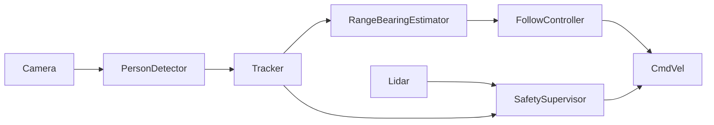

# Mobile Robotics Project

## Vision-Based Person-Following Mobile Robot

---

# 1. Mission Statement & Scope

The objective of this project is to design and implement a vision-based autonomous mobile robot capable of safely following a designated human target in indoor environments. The system will be deployed on a TurtleBot 4 Lite differential-drive mobile platform operating in structured indoor spaces such as hallways, classrooms, and laboratory corridors.

The robot will detect a person using onboard vision sensors, maintain a target following distance of approximately 1.0–1.5 meters, and continuously adjust its motion to keep the target centered within its field of view. The system must operate safely in shared human environments, immediately stopping in the event of lost target detection, sensor failure, or unsafe proximity to obstacles.

Success criteria include:

- Reliable person detection and tracking  
- Stable following distance maintenance  
- Smooth velocity control without oscillation  
- Safe stop under failure or hazard conditions  

---

# 2. Technical Specifications

## Robot Platform
- TurtleBot 4 Lite  
- Differential drive kinematic model  
- Wheel encoder odometry  
- IMU onboard  

## Sensors
- RGB-D camera (for person detection and depth estimation)  
- RPLIDAR (for obstacle monitoring)  
- Wheel encoders (odometry)  
- IMU (pose stabilization)  

## Software Framework
- ROS 2 (Humble or compatible distribution)  
- Standard `tf2` transform tree  
- Velocity control via `/cmd_vel`  

---

# 3. High-Level System Architecture

## System Diagram

## Module Declaration Table

| Module                    | Type    | Description                                   |
| ------------------------- | ------- | --------------------------------------------- |
| Camera Driver             | Library | Publishes RGB-D image streams                 |
| Person Detector (YOLO)    | Library | Detects human bounding boxes                  |
| Tracker                   | Custom  | Maintains consistent target identity          |
| Range & Bearing Estimator | Custom  | Computes relative pose of target              |
| Follow Controller         | Custom  | Generates velocity commands                   |
| Base Driver               | Library | Executes /cmd_vel commands                  |
| Safety Supervisor         | Custom  | Monitors hazards and enforces stop conditions |
| LiDAR Driver              | Library | Publishes obstacle range data                 |
