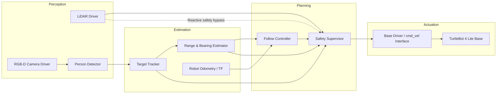

# Mobile Robotics Project

## Vision-Based Person-Following Mobile Robot

---

# 1. Mission Statement & Scope

The objective of this project is to design and implement a vision-based autonomous mobile robot capable of safely following a designated human target in indoor environments. The system will be deployed on a TurtleBot 4 Lite differential-drive mobile platform operating in structured indoor spaces such as hallways, classrooms, and laboratory corridors.

The robot will detect a person using onboard vision sensors, maintain a target following distance of approximately 1.0–1.5 meters, and continuously adjust its motion to keep the target centered within its field of view. The system must operate safely in shared human environments, immediately stopping in the event of lost target detection, sensor failure, or unsafe proximity to obstacles.

Success criteria include:

- Reliable person detection and tracking  
- Stable following distance maintenance  
- Smooth velocity control without oscillation  
- Safe stop under failure or hazard conditions  

---

# 2. Technical Specifications

## Robot Platform
- TurtleBot 4 Lite  
- Differential drive kinematic model  
- Wheel encoder odometry  
- IMU onboard  

## Sensors
- RGB-D camera (for person detection and depth estimation)  
- RPLIDAR (for obstacle monitoring)  
- Wheel encoders (odometry)  
- IMU (pose stabilization)  

## Software Framework
- ROS 2 (Humble or compatible distribution)  
- Standard `tf2` transform tree  
- Velocity control via `/cmd_vel`  

---

# 3. High-Level System Architecture

## System Diagram

## Module Declaration Table

| Module | Category | Type | Library / Custom | Purpose |
|------|------|------|------|------|
| RGB‑D Camera Driver | Perception | Sensor Interface | Library | Publishes RGB and depth image streams used for detecting and estimating the position of the person being followed. |
| LiDAR Driver | Perception | Sensor Interface | Library | Publishes 2D range scans used for obstacle awareness and emergency stopping. |
| Person Detection | Perception | Vision Inference | Library | Detects humans in the camera image using a pretrained object detection model. |
| Target Tracker | Estimation | State Estimation | Custom | Maintains a stable identity for the detected person across frames and filters noisy detections. |
| Range & Bearing Estimator | Estimation | Pose Estimation | Custom | Converts visual detections into relative distance and angular position of the person with respect to the robot. |
| Odometry / TF | Estimation | Localization | Library | Provides robot pose updates and coordinate transforms between robot and sensor frames. |
| Follow Controller | Planning | Motion Control | Custom | Generates velocity commands that allow the robot to follow the person at a desired distance. |
| Safety Supervisor | Planning | Safety Monitor | Custom | Monitors sensor health, obstacle distance, and target availability to stop the robot when necessary. |
| Base Driver (`/cmd_vel`) | Actuation | Hardware Interface | Library | Converts velocity commands into motor actions executed by the TurtleBot base. |
| TurtleBot 4 Lite Base | Actuation | Hardware Platform | Library / Hardware | Physical differential drive robot executing commanded motion. |

---

# Module Intent

## Library Modules

### RGB‑D Camera Driver

The RGB‑D camera driver is responsible for providing the main visual input for the robot. It publishes both RGB images and depth information that the rest of the perception stack relies on. The RGB stream is used by the person detection module to identify humans in the scene, while the depth data helps estimate how far the person is from the robot. Because this driver already exists within the ROS ecosystem, we treat it as a library component rather than implementing it ourselves. Our main responsibility will be configuring parameters such as frame rate, resolution, and topic names so the perception modules receive consistent and reliable data.

---

### LiDAR Driver

The LiDAR driver provides the robot with awareness of nearby obstacles. It continuously publishes range scans that indicate how far objects are from the robot in different directions. In this project the LiDAR is mainly used for safety rather than full mapping or navigation. The Safety Supervisor monitors these scans and immediately stops the robot if an object enters a predefined safety radius. Using an existing ROS driver ensures stable and real‑time access to LiDAR data without having to handle low‑level hardware communication ourselves.

---

### Person Detection

The person detection module uses a pretrained deep‑learning model to identify humans within each camera frame. Instead of building a detector from scratch, we rely on an existing model such as YOLO that has already been trained on large image datasets. The module outputs bounding boxes, confidence scores, and class labels for detected people. This approach allows the project to focus on robotics logic rather than computer vision training. The detection output becomes the input for the tracking and estimation modules that ultimately drive the robot’s behavior.

---

### Odometry / TF

The odometry and transform system provides the robot with information about its own movement. Wheel encoders estimate how far the robot has traveled, and the TF system maintains the coordinate relationships between different components such as the base frame, camera frame, and LiDAR frame. Even though the robot is primarily reacting to the position of a person, it still needs to know how its own movement affects perception and control. This module ensures that all data in the system shares a consistent coordinate reference.

---

### Base Driver (`/cmd_vel`)

The base driver is the interface between the high‑level control system and the robot hardware. It listens for velocity commands published to the `/cmd_vel` topic and converts them into wheel motions for the TurtleBot. This module handles the low‑level details of motor control and ensures the commands remain within safe limits. By relying on the standard ROS driver provided with the TurtleBot platform, we can focus our development on the person‑following behavior rather than on hardware control.

---

## Custom Modules

### Target Tracker

The target tracker maintains a consistent identity for the person that the robot is following. Raw detections from the vision model can fluctuate between frames due to occlusions, lighting changes, or multiple people appearing in view. Without tracking, the robot could repeatedly switch targets or behave unpredictably. The tracker solves this by associating detections over time and selecting the most consistent candidate to follow.

The module stores the position, size, and confidence of the selected detection across frames. By comparing new detections with previous ones, it determines whether the same person is still visible. If the detection disappears briefly, the tracker maintains the last known position for a short time before declaring the target lost. This smoothing helps stabilize the robot’s behavior and prevents sudden changes in motion.

---

### Range & Bearing Estimator

Once a person is detected and tracked, the robot still needs to understand where that person is relative to itself. The Range and Bearing Estimator converts the visual information into a more useful representation for motion control. It calculates two main values: the distance from the robot to the person and the horizontal angle offset between the robot’s forward direction and the person’s position.

Depth information from the RGB‑D camera is used to estimate distance, while the position of the bounding box in the image helps estimate the angle. Because depth readings can be noisy, the module filters measurements and removes outliers before publishing the final estimate. The output becomes the key input for the follow controller, allowing the robot to move in a way that maintains a comfortable distance from the person.

---

### Follow Controller

The follow controller is the module that determines how the robot moves in response to the person’s position. Its goal is to keep the robot a fixed distance behind the person while keeping the person centered in the camera view. The controller receives range and bearing estimates and converts them into linear and angular velocity commands.

If the person is too far away, the robot moves forward. If the person gets too close, the robot slows down or stops. At the same time, the controller adjusts the robot’s heading to keep the person in front of it. To avoid jerky movement, the controller applies limits to acceleration and smooths command changes over time. This helps produce natural motion that feels stable when the robot is following someone down a hallway or across a room.

---

### Safety Supervisor

The Safety Supervisor acts as the system’s protective layer. It constantly monitors important signals such as obstacle distance, sensor activity, and target tracking status. If something unusual happens, the supervisor overrides the controller and stops the robot immediately.

For example, if the LiDAR detects an obstacle within a dangerous distance, the robot will halt even if the follow controller is requesting forward motion. Similarly, if the vision system loses the person for several seconds, the robot will stop instead of continuing blindly. The supervisor also watches for stale data or communication failures between modules. By acting as a final checkpoint before motion commands reach the robot base, this module ensures the system behaves safely in real environments.

---

# 4. Safety & Operational Protocol

Because the robot operates around people in indoor spaces, safety is treated as a core design requirement rather than an afterthought. The system includes several safeguards that monitor sensor data, robot behavior, and communication between modules. If anything unexpected occurs, the robot will immediately stop instead of continuing to move without reliable information.

The safety system is primarily managed by the **Safety Supervisor module**, which continuously checks the health of the perception and control pipeline before allowing motion commands to reach the robot base.

---

### Deadman Switch and Timeout Logic

The system uses a timeout mechanism to ensure the robot only moves when all required data streams are active and up to date. Each important module publishes messages at a regular rate, and the Safety Supervisor monitors their timestamps.

If any required message stops arriving within the expected time window, the robot immediately stops.

The robot will halt if any of the following occurs:

- The person tracking module fails to publish updates for a short period of time
- Camera data stops arriving or becomes stale
- LiDAR scans are not received within the expected interval
- The follow controller stops publishing velocity commands
- Communication with the robot base is interrupted

This approach prevents the robot from moving based on outdated information.

---

### Emergency Stop Conditions

Several conditions can trigger an immediate stop. These checks run continuously while the robot is operating.

The robot will stop if:

- An obstacle is detected within the minimum safety distance using LiDAR
- The tracked person disappears from the camera view for longer than the allowed tracking window
- Sensor data becomes invalid or inconsistent
- The controller generates commands outside predefined safe limits
- Communication between critical ROS nodes fails

When one of these conditions occurs, the Safety Supervisor overrides all motion commands and publishes a zero-velocity command to the robot.

---

### Safe Recovery Behavior

Once the robot has stopped due to a safety event, it will remain stationary until normal operating conditions return. The robot does not automatically resume motion immediately after stopping.

Before motion resumes, the following conditions must be satisfied:

- The camera and LiDAR sensors are publishing valid data again
- The person detector has successfully reacquired the target
- No obstacle is present within the safety boundary
- All system modules are publishing messages normally

This recovery behavior ensures the robot does not start moving again until it is safe to do so.

---

### Operating Environment

The robot is designed to operate in **indoor environments** such as hallways, classrooms, and laboratory spaces. These environments typically have flat floors and predictable lighting conditions, which are suitable for vision-based tracking.

To keep the system reliable during development, the robot will initially be tested under controlled conditions:

- Indoor spaces with moderate lighting
- Limited clutter and foot traffic
- Clear walking paths for the person being followed

Testing will gradually expand to more dynamic environments once the basic following behavior is stable.

---

### Operational Guidelines

The following practices will be followed during testing and demonstrations:

- The robot will maintain a safe following distance of roughly **1–1.5 meters** from the person.
- Maximum speed will be limited to a conservative value during early experiments.
- Only one designated person will be followed at a time.
- If multiple people appear in the scene and the tracker becomes uncertain, the robot will stop rather than guessing a new target.
- An operator will always be nearby during testing to manually stop the robot if necessary.

These precautions help ensure that the robot behaves predictably and safely while interacting with people in shared spaces.
