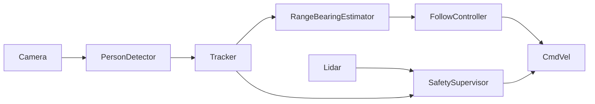

# Mobile Robotics Project

## Vision-Based Person-Following Mobile Robot

---

# 1. Mission Statement & Scope

The objective of this project is to design and implement a vision-based autonomous mobile robot capable of safely following a designated human target in indoor environments. The system will be deployed on a TurtleBot 4 Lite differential-drive mobile platform operating in structured indoor spaces such as hallways, classrooms, and laboratory corridors.

The robot will detect a person using onboard vision sensors, maintain a target following distance of approximately 1.0–1.5 meters, and continuously adjust its motion to keep the target centered within its field of view. The system must operate safely in shared human environments, immediately stopping in the event of lost target detection, sensor failure, or unsafe proximity to obstacles.

Success criteria include:

- Reliable person detection and tracking  
- Stable following distance maintenance  
- Smooth velocity control without oscillation  
- Safe stop under failure or hazard conditions  

---

# 2. Technical Specifications

## Robot Platform
- TurtleBot 4 Lite  
- Differential drive kinematic model  
- Wheel encoder odometry  
- IMU onboard  

## Sensors
- RGB-D camera (for person detection and depth estimation)  
- RPLIDAR (for obstacle monitoring)  
- Wheel encoders (odometry)  
- IMU (pose stabilization)  

## Software Framework
- ROS 2 (Humble or compatible distribution)  
- Standard `tf2` transform tree  
- Velocity control via `/cmd_vel`  

---

# 3. High-Level System Architecture

## System Diagram

## Module Declaration Table

| Module | Category | Type | Library / Custom | Purpose |
|------|------|------|------|------|
| RGB‑D Camera Driver | Perception | Sensor Interface | Library | Publishes RGB and depth image streams used for detecting and estimating the position of the person being followed. |
| LiDAR Driver | Perception | Sensor Interface | Library | Publishes 2D range scans used for obstacle awareness and emergency stopping. |
| Person Detection | Perception | Vision Inference | Library | Detects humans in the camera image using a pretrained object detection model. |
| Target Tracker | Estimation | State Estimation | Custom | Maintains a stable identity for the detected person across frames and filters noisy detections. |
| Range & Bearing Estimator | Estimation | Pose Estimation | Custom | Converts visual detections into relative distance and angular position of the person with respect to the robot. |
| Odometry / TF | Estimation | Localization | Library | Provides robot pose updates and coordinate transforms between robot and sensor frames. |
| Follow Controller | Planning | Motion Control | Custom | Generates velocity commands that allow the robot to follow the person at a desired distance. |
| Safety Supervisor | Planning | Safety Monitor | Custom | Monitors sensor health, obstacle distance, and target availability to stop the robot when necessary. |
| Base Driver (`/cmd_vel`) | Actuation | Hardware Interface | Library | Converts velocity commands into motor actions executed by the TurtleBot base. |
| TurtleBot 4 Lite Base | Actuation | Hardware Platform | Library / Hardware | Physical differential drive robot executing commanded motion. |

---

---

# Module Intent & Algorithmic Design

## Camera Driver 

The camera driver publishes RGB and depth image streams to ROS topics. It will be configured to operate at moderate resolution to balance detection accuracy and computational efficiency. Depth alignment parameters will be tuned to ensure consistent pixel-to-depth mapping.

---

## Person Detector

A YOLO-based detector will be used to identify human bounding boxes in RGB images. The detector is selected for its robustness in indoor lighting conditions and real-time performance capability. Confidence thresholds will be tuned to minimize false positives while maintaining reliable recall. Non-maximum suppression parameters will be adjusted to ensure a single bounding box per detected individual.

---

## Tracker 

The tracker maintains a persistent identity for the target human across frames. A nearest-neighbor association strategy will be implemented using bounding box centroid proximity and confidence scoring. Temporal smoothing will be applied using a first-order low-pass filter or Kalman filter to reduce jitter in bounding box position estimates. If the target is lost for more than a defined timeout period, the system will trigger recovery or stop behavior.

---

## Range & Bearing Estimator 

The estimator computes the relative distance and angular offset of the detected target in the robot's base frame. Using the aligned depth image, the median depth value within the bounding box region will be extracted to reduce noise. Bearing will be calculated from pixel displacement relative to the optical center using intrinsic camera parameters. The output will be a relative pose representation used by the follow controller.

---

## Follow Controller 

The follow controller converts relative range and bearing into linear and angular velocity commands. A proportional control strategy will regulate forward velocity based on distance error from the desired following range. Angular velocity will be computed from bearing offset to keep the target centered. Velocity limits and acceleration smoothing will be enforced to ensure stable and safe motion.

---

## Base Driver 

The TurtleBot base driver receives velocity commands via /cmd_vel and translates them into wheel velocities. No modification to this module is required beyond respecting velocity limits.

---

## Safety Supervisor 

The safety supervisor operates as an independent monitoring layer. It listens to LiDAR data, target tracking status, and sensor timestamps. If the target is lost for more than a defined timeout, if an obstacle is detected within a predefined safety radius, or if sensor messages stop arriving, the supervisor overrides motion commands and issues zero velocity. This ensures safe operation in shared human environments.

---
