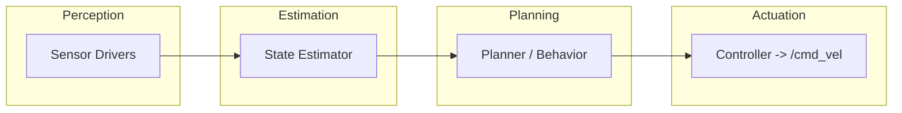

# Project Milestone 1: Proposal & Architecture

> **Due:** Mar 6  
> **Word limit:** ~1,500 words  

## 1. Mission Statement & Scope

**Mission:** TODO

**Scope:** TODO

**Success state:** TODO

## 2. Technical Specifications

- **Robot platform:** TODO (TurtleBot 4 or simulation)
- **Kinematic model:** TODO (Differential / Ackermann / Holonomic)
- **Perception stack:** TODO (LiDAR, RGB-D, IMU)

## 3. High-Level System Architecture

### 3.1 Mermaid Diagram

### 3.2 Module Declaration Table

| Module / Node | Functional Domain | Software Type (Library/Custom) | Description |
|---|---|---|---|
| Sensor Drivers | Perception | Library | TODO |
| State Estimator | Estimation | Library | TODO |
| Planner / Behavior | Planning | Custom | TODO |
| Controller | Actuation | Library | TODO |
| Safety Supervisor | Planning | Custom | TODO |

### 3.3 Module Intent (Required)

#### Library Modules (50–150 words each)
- **Sensor Drivers:** TODO
- **State Estimator:** TODO
- **Controller:** TODO

#### Custom Modules (100–200 words each)
- **Planner / Behavior:** TODO
- **Safety Supervisor:** TODO

## 4. Safety & Operational Protocol

**Deadman switch / timeout logic:** TODO

**E-Stop triggers:** TODO

## 5. Git Infrastructure

- **Shared team repo:** TODO (link)
- **Git submodule enabled on individual site:** TODO (confirm)
