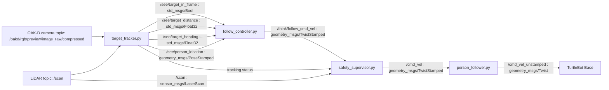
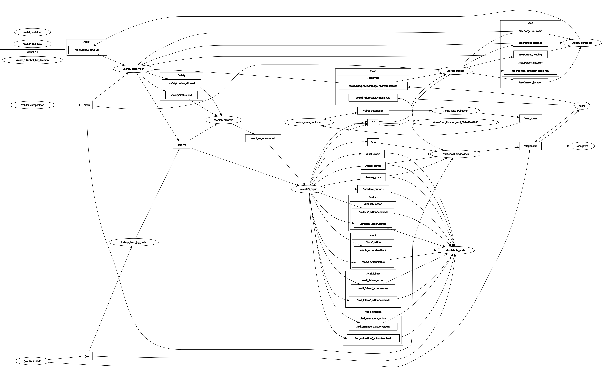
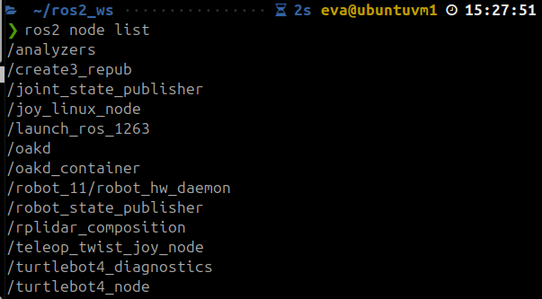
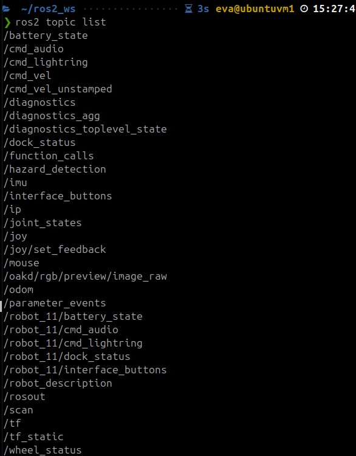
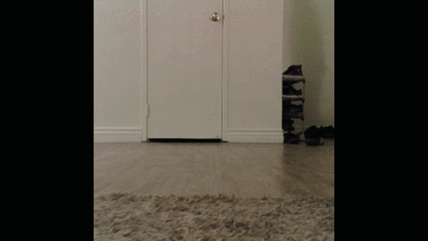

# Autonomous Human-Following Mobile Robot

**Course:** RAS 598 — Mobile Robotics  
**Platform:** TurtleBot 4 with iRobot Create 3 base  
**Sensors:** OAK-D RGB camera, 2D LiDAR  
**Software:** ROS 2 Jazzy  
**Team:** Harsh Padmalwar, Atharv Kulkarni

---

## Overview

In this project, we built an autonomous human-following mobile robot using a TurtleBot 4. Our robot detects a person in the camera feed using YOLO, estimates the person’s distance and heading, and commands the base to move toward the detected person while maintaining a safe following distance.

Our implementation has moved well beyond the original Milestone 1 proposal. The current runtime pipeline is built around four active custom ROS 2 nodes:

- `target_tracker.py`
- `follow_controller.py`
- `safety_supervisor.py`
- `person_follower.py`

At this stage, the robot can detect a person and move toward them on hardware. The main issue that still remains is heading regulation during forward motion. While approaching a person, the TurtleBot can drift sideways, which causes the person to move out of the camera view. Once the target leaves the frame, the robot stops forward motion and enters search behavior. Fixing this centering and search behavior is one of our main Milestone 3 goals.

---

## Current Objective

Our current objective is to make the TurtleBot:

1. detect a person in the camera frame
2. estimate the person’s relative heading and distance
3. move toward the person while maintaining safe separation
4. stop safely when sensor data becomes stale or unsafe
5. reacquire the person when they temporarily leave the field of view

---

## Milestone Progress Summary

### What we proposed in Milestone 1

In Milestone 1, we proposed:

- a TurtleBot 4 differential-drive platform
- camera-based human detection
- LiDAR-based obstacle monitoring
- a modular ROS 2 architecture
- a follow controller driven by target distance and heading
- a safety layer to override unsafe commands

### What we achieved in Milestone 2

In Milestone 2, we implemented and tested a working hardware-integrated pipeline that:

- subscribes to TurtleBot camera and LiDAR topics
- uses YOLO to detect a person
- estimates target heading and distance
- publishes follow commands
- applies a safety supervision layer
- forwards safe velocity commands to the TurtleBot base
- demonstrates real robot motion toward a detected person

### What we plan to improve in Milestone 3

In Milestone 3, we plan to improve:

- heading stability during forward motion
- centering of the person in the camera viewport
- search behavior based on the **last seen bounding-box direction**
- reacquisition after temporary target loss
- target retention during brief perception flicker

---

## Hardware and Software Stack

### Hardware

- TurtleBot 4
- iRobot Create 3 differential-drive mobile base
- OAK-D RGB camera
- 2D LiDAR

### Software

- ROS 2 Jazzy / compatible
- Python
- YOLO-based person detector
- RViz
- `rqt_graph`

---

## Kinematics

### Why this section matters

There are two levels of kinematics that matter in this project:

1. **Robot kinematics** — how the TurtleBot differential-drive base moves when commanded  
2. **Follower control logic** — how we convert the detected person’s distance and heading into motion commands  

---

### Differential-drive robot model

We model the TurtleBot base as a **differential-drive / unicycle robot**.

Let:

- `r` = wheel radius
- `L` = distance between the left and right wheel contact centers
- `omega_R` = right wheel angular velocity
- `omega_L` = left wheel angular velocity

The linear velocity of each wheel is:

$$
v_R = r \omega_R
$$

$$
v_L = r \omega_L
$$

The body-frame linear and angular velocities are:

$$
v = \frac{v_R + v_L}{2}
$$

$$
\omega = \frac{v_R - v_L}{L}
$$

Equivalently,

$$
v = \frac{r}{2}(\omega_R + \omega_L)
$$

$$
\omega = \frac{r}{L}(\omega_R - \omega_L)
$$

These define the commanded robot body velocity.

---

### State update equations

We write the robot pose in the world frame as:

$$
\mathbf{x} =
\begin{bmatrix}
x \\
y \\
\theta
\end{bmatrix}
$$

where:

- `x` and `y` are planar position
- `theta` is robot heading

The continuous-time kinematics are:

$$
\dot{x} = v \cos\theta
$$

$$
\dot{y} = v \sin\theta
$$

$$
\dot{\theta} = \omega
$$

A simple discrete-time update with timestep `Delta t` is:

$$
x_{k+1} = x_k + v_k \cos\theta_k \, \Delta t
$$

$$
y_{k+1} = y_k + v_k \sin\theta_k \, \Delta t
$$

$$
\theta_{k+1} = \theta_k + \omega_k \, \Delta t
$$

This is the standard kinematic model for a differential-drive robot.

---

### How we use these kinematics in the project

Our code does **not** command left and right wheel velocities directly. Instead, the controller computes:

- `linear.x` = forward speed `v`
- `angular.z` = yaw rate `omega`

These are published as velocity commands and then consumed by the TurtleBot motion interface.

So in our implementation, the controller outputs the **unicycle control input**:

$$
\mathbf{u} =
\begin{bmatrix}
v \\
\omega
\end{bmatrix}
$$

and the TurtleBot base internally applies the differential-drive mapping.

That means our documentation needs to show both:

- the **wheel-level differential-drive equations**
- the **body-level `v, omega` state equations**

because our code works at the `v, omega` level while the robot itself is physically differential drive.

---

### Person-following control law used in our code

Our active controller uses the detected person’s:

- distance `d`
- heading `alpha`

and compares the distance to a desired follow distance `d*`.

#### Distance error

$$
e_d = d - d^\*
$$

#### Heading error

$$
e_\alpha = \alpha
$$

#### Proportional controller

$$
v_{\text{raw}} = k_p^{(d)} e_d
$$

$$
\omega_{\text{raw}} = k_p^{(\alpha)} e_\alpha
$$

#### Heading deadband

If the heading error is small enough, we suppress angular correction:

$$
\omega_{\text{raw}} = 0
\quad \text{if} \quad |e_\alpha| < \alpha_{\text{deadband}}
$$

#### Forward-speed reduction during heading error

To reduce forward speed when the person is off-center, we scale linear velocity by a cosine term:

$$
v = v_{\text{raw}} \cdot \max(0.2,\cos(e_\alpha))
$$

This means:

- if the person is well centered, forward motion is strong
- if the person is off-center, forward motion is reduced
- but the robot still keeps moving instead of instantly switching to turn-only mode

#### Smoothed angular velocity

We also low-pass filter angular velocity:

$$
\omega_k = \lambda \, \omega_{\text{raw}} + (1-\lambda)\omega_{k-1}
$$

where `lambda` is the smoothing factor.

#### Saturation

Finally, we clamp the output:

$$
0 \le v \le v_{\max}
$$

$$
-\omega_{\max} \le \omega \le \omega_{\max}
$$

This matches the behavior of our current follow controller.

---

### Math-to-code alignment

The main mapping from the equations to the ROS 2 implementation is:

| Math Quantity | Code Variable / Topic | Where it appears |
|---|---|---|
| `d` | `/see/target_distance` | `target_tracker.py` → `follow_controller.py` |
| `alpha` | `/see/target_heading` | `target_tracker.py` → `follow_controller.py` |
| `e_d = d - d*` | `range_error` | `follow_controller.py` |
| `e_alpha = alpha` | `angle_error` | `follow_controller.py` |
| `v` | `linear.x` | `follow_controller.py` → `safety_supervisor.py` → `person_follower.py` |
| `omega` | `angular.z` | `follow_controller.py` → `safety_supervisor.py` → `person_follower.py` |

---

### Why the robot currently drifts

Our current system demonstrates the correct overall structure, but one issue remains:

- the robot moves forward while applying heading corrections
- the heading corrections are not yet stable enough to keep the person centered
- the person can drift out of the camera view
- once the target is lost, the robot enters search behavior

So the kinematics are correct, but the **control tuning and target retention logic** still need improvement. This is a control-performance issue, not a differential-drive kinematics issue.

---

## System Architecture

The older Milestone 1 flow is no longer the best representation of what is actually running. Our current implementation is simpler and directly aligned with the current codebase.

### Active node pipeline

```text
Camera + LiDAR
→ target_tracker.py
→ follow_controller.py
→ safety_supervisor.py
→ person_follower.py
→ TurtleBot base
```

---

## Detailed Computational Map

### Updated Mermaid Diagram



### rqt_graph

We included an <code>rqt_graph</code> export of the running pipeline here:

<p align="center">
  
</p>

### Topics in the active flow

| Topic | Message Type |
|---|---|
| `/oakd/rgb/preview/image_raw/compressed` | `sensor_msgs/CompressedImage` |
| `/scan` | `sensor_msgs/LaserScan` |
| `/see/target_in_frame` | `std_msgs/Bool` |
| `/see/person_location` | `geometry_msgs/PoseStamped` |
| `/see/target_distance` | `std_msgs/Float32` |
| `/see/target_heading` | `std_msgs/Float32` |
| `/think/follow_cmd_vel` | `geometry_msgs/TwistStamped` |
| `/cmd_vel` | `geometry_msgs/TwistStamped` |
| `/cmd_vel_unstamped` | `geometry_msgs/Twist` |

### Services and actions in the current active flow

Our current Milestone 2 runtime path does not use any **custom** ROS 2 services or actions in the person-following stack shown above. The active path is topic-driven.

---

## Module Declaration Table

This table reflects the current project state and updates the older Milestone 1 declaration.

| Module | Category | Type | Status | Change from Milestone 1 | Purpose |
|---|---|---|---|---|---|
| OAK-D camera topics | Perception | Library | Active | Still used | Publishes RGB images for person detection |
| LiDAR `/scan` | Perception / Safety | Library | Active | Still used | Provides obstacle and range information |
| YOLO person detector | Perception | Library | Active | Still used | Detects people in the RGB feed |
| `target_tracker.py` | Perception | Custom | Active | Simplified from earlier architecture | Detects a person, computes heading and distance, publishes target topics |
| `follow_controller.py` | Control | Custom | Active / being tuned | Updated from original planner concept | Generates motion commands to move toward the person |
| `safety_supervisor.py` | Safety | Custom | Active | Added as explicit final safety layer | Stops the robot when perception or control data becomes stale or unsafe |
| `person_follower.py` | Actuation bridge | Custom | Active | New bridge in current flow | Sends safe motion commands to the TurtleBot base |
| RViz | Visualization | Library | Active | Used in our Milestone 2 demo | Shows live topics and camera view |
| `rqt_graph` | Debugging / documentation | Library | Active | Added to reflect the real ROS 2 graph | Documents node and topic plumbing |

---

## Module Descriptions

### `target_tracker.py`

**Source:**  
[`target_tracker.py`](../person_follower/target_tracker.py)

**Purpose:**  
We use this node to detect a person with YOLO and publish the target state used by the rest of the stack.

**Subscribes to:**
- `/oakd/rgb/preview/image_raw/compressed`
- `/scan`

**Publishes to:**
- `/see/target_in_frame`
- `/see/person_location`
- `/see/target_distance`
- `/see/target_heading`

**Logic flow:**
1. subscribe to compressed RGB frames from the OAK-D camera
2. run YOLO person detection on the incoming frame
3. identify the person bounding box in image coordinates
4. compute the target heading from image-center offset
5. estimate target distance using LiDAR
6. publish the target state to the control pipeline

**Current tuned parameters:**

| Parameter | Current Value | Purpose |
|---|---|---|
| `model_path` | `yolov8n.pt` | YOLO model file |
| `device` | `cpu` or `cuda:0` | Compute target for inference |
| `confidence_threshold` | `0.4` | YOLO detection filtering |
| `fallback_distance` | `2.0` | Used when LiDAR distance is unavailable |
| position filter window | `7` | Smooths target position estimates |
| position filter minimum confidence | `3` | Minimum valid measurements before trusted output |
| alpha-beta distance filter alpha | `0.25` | Distance smoothing |

**Hardware-specific notes:**
- camera topic used: `/oakd/rgb/preview/image_raw/compressed`
- current camera-to-LiDAR offset used in heading logic:
  - `dx = 0.0635`
  - `dy = 0.0381`

**Current limitation:**  
Target visibility can flicker if the person moves out of the frame or the detector becomes inconsistent for a few frames.

---

### `follow_controller.py`

**Source:**  
[`follow_controller.py`](../person_follower/follow_controller.py)

**Purpose:**  
We use this node to move the robot toward the person while trying to keep the person centered in the camera frame.

**Subscribes to:**
- `/see/target_in_frame`
- `/see/person_location`
- `/see/target_distance`
- `/see/target_heading`
- `/think/ctrl_cmd` (optional control input)

**Publishes to:**
- `/think/planner_state`
- `/think/follow_cmd_vel`

**Logic flow:**
1. receive target visibility, heading, and distance
2. compute distance error relative to the desired following distance
3. compute angular correction using target heading
4. reduce forward speed when heading error increases
5. publish a stamped velocity command for the safety layer

**Current tuned parameters:**

| Parameter | Current Value | Purpose |
|---|---|---|
| `follow_distance` | `1.0` | Desired stand-off distance |
| `search_rot_speed` | `0.4` | Search rotation speed when target is lost |
| `kp_linear` | `0.45` | Linear proportional gain |
| `kp_angular` | `0.45` | Angular proportional gain |
| `max_linear_speed` | `0.22` | Linear velocity limit |
| `max_angular_speed` | `0.6` | Angular velocity limit |
| `deadband_angle_deg` | `4.0` | Small-angle deadband |
| `control_rate` | `10.0` | Control loop rate |
| `min_valid_distance` | `0.2` | Minimum usable distance |
| `max_valid_distance` | `5.0` | Maximum usable distance |
| `target_lost_timeout` | `0.5` | Short memory window before search mode |

**Current limitation:**  
The TurtleBot can move toward the person but still over-correct in heading, causing the person to drift out of view. This is one of our main Milestone 3 tuning tasks.

---

### `safety_supervisor.py`

**Source:**  
[`safety_supervisor.py`](../person_follower/safety_supervisor.py)

**Purpose:**  
We use this node as the final protective layer before commands reach the robot base.

**Subscribes to:**
- `/think/follow_cmd_vel`
- `/scan`
- relevant perception status topics
- camera activity topics

**Publishes to:**
- `/cmd_vel`
- optional safety status topics

**Logic flow:**
1. monitor obstacle distance from LiDAR
2. monitor target visibility and stale-data conditions
3. validate controller output
4. override unsafe commands with zero velocity
5. publish only safe motion commands downstream

**Current tuned parameters:**

| Parameter | Current Value | Purpose |
|---|---|---|
| `min_obstacle_distance` | `0.50` | Safety stop radius |
| `target_loss_timeout` | `2.0` | Stop if person is lost too long |
| `camera_timeout` | `1.0` | Camera heartbeat timeout |
| `lidar_timeout` | `1.0` | LiDAR heartbeat timeout |
| `controller_timeout` | `1.0` | Controller heartbeat timeout |
| `max_linear_speed` | `0.30` | Acceptable command limit |
| `max_angular_speed` | `1.20` | Acceptable angular command limit |
| `scan_angle_min_deg` | `-25.0` | Front scan window start |
| `scan_angle_max_deg` | `25.0` | Front scan window end |
| `publish_rate` | `20.0` | Safety loop rate |

**Why it matters:**  
This node prevents the robot from moving blindly when the target or sensors become unreliable.

---

### `person_follower.py`

**Source:**  
[`person_follower/person_follower.py`](../person_follower/person_follower.py)

**Purpose:**  
We use this node to bridge the safe control command to the TurtleBot motion interface.

**Subscribes to:**
- `/cmd_vel`

**Publishes to:**
- `/cmd_vel_unstamped`

**Logic flow:**
1. receive safe stamped velocity command
2. convert it to the format used by the TurtleBot base in our current setup
3. publish the final command that makes the robot move in real life

**Current tuned parameters:**

| Parameter | Current Value | Purpose |
|---|---|---|
| `input_topic` | `/cmd_vel` | Safe input command topic |
| `output_topic` | `/cmd_vel_unstamped` | Base motion command topic |
| `command_timeout` | `0.75` | Stop if command stream goes stale |
| `max_linear_speed` | `0.30` | Clamp base linear command |
| `max_angular_speed` | `1.20` | Clamp base angular command |
| `publish_rate` | `20.0` | Publish loop rate |

---

## Experimental Analysis and Validation

### ROS Communication Proof

We verified that the active nodes in our Milestone 2 stack are functional and able to communicate over ROS 2.

**Completed active nodes:**
- `target_tracker.py`
- `follow_controller.py`
- `safety_supervisor.py`
- `person_follower.py`

The screenshots below show the active ROS graph from our hardware-tested setup.

#### ROS node list



#### ROS topic list



During testing, we also verified that the controller was publishing follow commands on `/think/follow_cmd_vel` and that safe motion commands were propagated downstream through the safety and actuation pipeline.
---

### Noise and Uncertainty Analysis

#### Hardware calibration, offsets, and tuning

The project is running on hardware, so our main uncertainty sources come from the camera, LiDAR, and target-detection pipeline.

**Camera / geometry assumptions currently used in code:**

| Quantity | Current Value | Notes |
|---|---|---|
| `fx` | `1012.88` | Camera focal scale in x |
| `fy` | `1012.88` | Camera focal scale in y |
| `cx` | `634.40` | Principal point x |
| `cy` | `363.77` | Principal point y |
| `dx` | `0.0635` | Camera-to-LiDAR x offset used in heading logic |
| `dy` | `0.0381` | Camera-to-LiDAR y offset used in heading logic |

#### Measured / observed uncertainty during hardware runs

**Add a real table here from your test data:**

| Quantity Tested | Test Condition | Observed Value / Range | Notes |
|---|---|---|---|
| target distance | person standing still at known location | `ADD_RANGE_HERE` | measured from `/see/target_distance` |
| target heading | person standing still in center view | `ADD_RANGE_HERE` | measured from `/see/target_heading` |
| heading jitter | person stationary, robot stationary | `ADD_STD_DEV_HERE` | estimate from repeated samples |
| detection flicker | person partially near image edge | `ADD_OBSERVATION_HERE` | target visibility instability |

#### Parameter tuning we used to adapt to noise

- position filter window = `7`
- distance alpha-beta filter alpha = `0.25`
- angular smoothing = `0.2`
- `target_lost_timeout` in controller = `0.5`
- `target_loss_timeout` in safety = `2.0`

These were tuned to reduce abrupt motion changes and prevent immediate failure on one missed frame.

#### Simulation note

Our current milestone path is a **hardware track**, not a simulation-only track. Because of that, the standalone simulation noise injector node is **not part of the active Milestone 2 runtime stack**.

If we later add a simulation validation branch, we will document the standalone noise injector there.

---

### Run-time Issues We Observed

During our hardware runs, we observed the following behaviors:

- the TurtleBot successfully detects a person and begins moving forward
- the robot can still drift sideways while approaching the target
- the person is not always kept centered in the camera viewport
- if the person leaves the frame, the controller enters search behavior
- the search is not yet directed using the last seen bounding-box location
- intermittent target flicker can cause unstable following

**Specific issue we plan to fix next:**
- when the person leaves the frame, we want the TurtleBot to search in the direction where the bounding box was last seen instead of using a more generic search behavior

---

## Demonstration Videos

The GIF previews below are visible directly in the report. Clicking on each GIF opens the full video file stored in the repository.

### RViz Camera-View Demo

This demo shows:

- the TurtleBot camera stream visualized in RViz
- YOLO detecting a person
- the TurtleBot beginning to move toward the person

[](../docs/Videos/RVIZ.mp4)

**Video file:**  
[`RVIZ.mp4`](../docs/Videos/RVIZ.mp4)

---

### Person Point-of-View Demo

This demo shows:

- a person standing in front of the TurtleBot
- the TurtleBot moving toward the person
- the sideways drift and heading issue
- the robot re-entering search mode when the person moves out of the camera view

[](../docs/Videos/POV.mp4)

**Video file:**  
[`POV.mp4`](../docs/Videos/POV.mp4)

---

## Safety and Operational Protocol

Because the robot operates around people in indoor spaces, we treat safety as a core requirement.

### The robot stops if:

- an obstacle is detected within the minimum safety distance
- the target tracking signal becomes stale
- camera data or LiDAR data stops arriving
- controller commands stop arriving
- unsafe motion commands are generated

### Recovery behavior

The robot remains stationary until:

- camera and LiDAR streams are valid again
- the target is reacquired
- no obstacle is inside the safety boundary
- the required nodes are publishing normally again

---

## Repository Structure

```text
Autonomous-Human-Following-Mobile-Robot/
├── .github/
├── _includes/
├── _layouts/
├── assets/
├── config/
├── docs/
│   ├── Images/
│   │   ├── rqt_graph_m2.png
│   │   ├── rosnodelist.png
│   │   └── rostopiclist.jpeg
│   └── Videos/
│       ├── RVIZ.gif
│       ├── RVIZ.mp4
│       ├── POV.gif
│       └── POV.mp4
├── person_follower/
│   ├── __init__.py
│   ├── target_tracker.py
│   ├── follow_controller.py
│   ├── safety_supervisor.py
│   ├── person_follower.py
│   └── ...
├── project/
│   ├── index.md
│   ├── report1.md
│   ├── report2.md
│   └── report3.md
├── resource/
├── test/
├── _config.yml
├── index.md
├── .gitignore
├── Gemfile
├── package.xml
├── setup.py
└── setup.cfg
---

## Build Instructions

```bash
cd ~/ros2_ws/src
git clone https://github.com/Hp092/Autonomous-Human-Following-Mobile-Robot.git
cd ~/ros2_ws
colcon build --packages-select person_follower
source install/setup.bash
```

---

## Example Run Sequence

### Ensure robot topics are visible

Relevant runtime topics include:

- `/oakd/rgb/preview/image_raw/compressed`
- `/scan`
- `/cmd_vel`
- `/cmd_vel_unstamped`

### Start the perception node

```bash
ros2 run person_follower target_tracker
```

### Start the controller

```bash
ros2 run person_follower follow_controller
```

### Start the safety supervisor

```bash
ros2 run person_follower safety_supervisor
```

### Start the base command bridge

```bash
ros2 run person_follower person_follower
```

### Visualize in RViz

- `/see/person_detector/image_raw`

---

## Known Issues

- the robot can follow, but the heading is not yet perfectly regulated
- the person is not always kept centered in the camera viewport
- the robot can drift sideways while moving forward
- when the person leaves the frame, the robot enters search mode
- search is not yet guided by the last seen bounding-box direction
- target retention is still sensitive to intermittent detection loss

---

## Feedback Integration Table

| Milestone 1 Feedback / Question | What we changed in Milestone 2 | Current Status |
|---|---|---|
| The custom modules are Target Tracker and Range & Bearing Estimator. The former is probably going to use a library that gives you the 2D/3D position, and the latter is a few lines of code. If this is not true, please let me know what the expected work is. | We revised the architecture and simplified the runtime stack. Instead of keeping `range_bearing_estimator` as a separate active node in the final flow, we integrated heading and distance estimation directly inside `target_tracker.py` using YOLO detections from the RGB camera and distance estimation from LiDAR. We also added three custom modules beyond the original proposal: `follow_controller.py`, `safety_supervisor.py`, and `person_follower.py`, which together handle motion generation, safety overrides, and hardware command forwarding. | Done |
| The project website does not render properly. I read your report from the git repo README file on GitHub. | We reorganized the milestone documentation into separate report files inside the repository and corrected Markdown rendering issues such as broken Mermaid syntax, math formatting, and media/image paths. We also updated the documentation structure so the report can be read directly from the repository in rendered Markdown form. | Done |
| What happens when someone walks in between the robot and the person? Is this something you expect to tackle in this project? | In the current implementation, this case is not fully solved. If the tracked person is occluded or leaves the camera frame, the robot can lose the target and switch into search behavior. We documented this as a current limitation and identified target retention/reacquisition as a Milestone 3 improvement area. | Pending |
| Are you estimating the future trajectory of the person so you can recover when lost? | No future trajectory prediction is implemented in the current code. The present controller uses current distance and heading measurements, short-term smoothing, and a timeout-based recovery/search behavior. We plan to improve recovery in Milestone 3 by using the last seen bounding-box direction when the target is lost. | Not yet implemented |
| A part of robotics in the real world is to signify the robot's intentions to the people around it (the person it's following, or other people sharing the environment). Are you planning to use auditory or visual cues to signify this? | We have not implemented auditory or visual intention cues in the current Milestone 2 code. Our effort in this milestone was focused on perception, following control, safety supervision, and hardware integration. This remains a possible extension for a future milestone if time permits. | Not yet implemented |
| If you plan to use the TurtleBot outside the lab, how do you plan to set up a WiFi access point to communicate with the robot over ROS? | Outdoor or off-lab network deployment is not implemented in the current project code. Our Milestone 2 workflow uses the TurtleBot communication setup available in the course environment, including SSH access and ROS topic visibility from the external machine. We documented the current setup as the active hardware workflow, but we have not yet developed a custom standalone WiFi access point solution. | Not yet implemented |
| How can you make sure the person it's following is unique compared to other people in the environment? | The current implementation does not yet guarantee unique target identity in a multi-person scene. We are using YOLO-based person detection and the active stack does not yet include persistent identity tracking or re-identification. We explicitly documented this as an open challenge and a future extension area. | Pending |
| Positive feedback: the safety recovery behavior is a strong professional addition. | We preserved and expanded this idea by implementing `safety_supervisor.py` as an explicit runtime safety layer. It monitors command freshness, target visibility, and obstacle conditions, and overrides unsafe motion with stop commands before commands reach the base. | Done |

---

## Individual Contribution Table

> We will replace the placeholders below with our actual commit history before submission.

| Team Member | Primary Technical Role | Key Git Commits / PRs | Specific File(s) Authorship |
|---|---|---|---|
| Harsh Padmalwar | Control, safety, integration, documentation | `COMMIT_HASH_HERE` | [`person_follower/follow_controller.py`](person_follower/follow_controller.py), [`person_follower/safety_supervisor.py`](person_follower/safety_supervisor.py), [`README.md`](README.md) |
| Atharv Kulkarni | Perception, YOLO integration, hardware testing, documentation | `COMMIT_HASH_HERE` | [`person_follower/target_tracker.py`](person_follower/target_tracker.py), [`person_follower/person_follower.py`](person_follower/person_follower.py), [`README.md`](README.md) |

---

## Git Audit Readiness

To keep our repo audit-ready, we will make sure that:

- all code is committed incrementally
- both team members have visible authored commits
- file authorship matches the contributions claimed in the report
- the final submission includes the exact commit hash used for grading

---

## Milestone 3 Plan

For Milestone 3, we will focus on improving follow quality rather than just proving integration.

### Planned work

- improve heading regulation during forward motion
- keep the person centered in the camera viewport
- use the **last seen bounding-box direction** when entering search mode
- reduce search oscillation
- improve reacquisition after temporary target loss
- reduce perception flicker
- perform additional hardware tuning and validation

---

## Conclusion

Our project has moved from a Milestone 1 design proposal into a Milestone 2 hardware-tested system capable of detecting a person and moving toward them autonomously. The current implementation demonstrates successful integration of perception, control, safety, and actuation on the TurtleBot platform.

The main remaining challenge is not the robot kinematics themselves, but the **quality of follow control and visual centering during motion**. In Milestone 3, we will focus on refining this behavior so the robot can follow more naturally, keep the person centered in view, and search intelligently when the target is briefly lost.

---

## References

- TurtleBot 4 User Manual
- ROS 2 Documentation
- Ultralytics YOLO Documentation
- OAK-D Documentation
- RAS 598 project milestone page
