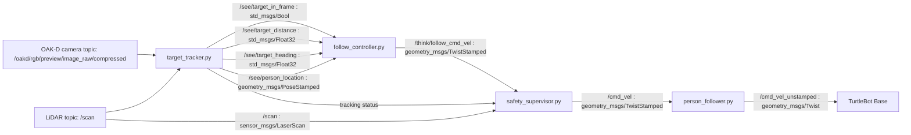

# Autonomous Human-Following Mobile Robot

**Course:** RAS 598 — Mobile Robotics  
**Platform:** TurtleBot 4   
**Sensors:** OAK-D RGB camera, 2D LiDAR  
**Software:** ROS 2 Jazzy   
**Team:** Harsh Padmalwar, Atharv Kulkarni

---

## Overview

In this project, we built an autonomous human-following mobile robot using a TurtleBot 4. Our robot detects a person in the camera feed using YOLO, estimates the target’s distance and heading, and commands the base to move toward the person while maintaining a safe following distance.

Our project has moved well beyond the original Milestone 1 concept. The current implementation is organized around four active custom ROS 2 nodes:

- `target_tracker.py`
- `follow_controller.py`
- `safety_supervisor.py`
- `person_follower.py`

We now have a hardware-tested pipeline. The TurtleBot is able to detect a person and move toward them. The main limitation at this stage is that while moving forward, the robot can still drift in heading, which causes the detected person to move out of the camera view. Once that happens, the robot stops moving forward and enters search behavior. Improving this heading-centering behavior is one of our main goals for Milestone 3.

---

## Current Objective

Our current objective is to make the TurtleBot:

1. detect a person in the camera frame
2. estimate the person’s relative heading and distance
3. move toward the person while maintaining safe separation
4. stop safely when sensor data becomes stale or unsafe
5. reacquire the person when they temporarily leave the field of view

---

## Milestone Progress Summary

### What we proposed in Milestone 1

In Milestone 1, we focused on system design and planning. Our original proposal included:

- a TurtleBot 4 differential-drive platform
- camera-based human detection
- LiDAR-based obstacle monitoring
- a modular ROS 2 architecture
- a follow controller using target distance and heading
- a safety layer to override unsafe commands

### What we achieved in Milestone 2

At this stage, we have a working hardware-integrated pipeline that:

- subscribes to TurtleBot camera and LiDAR topics
- uses YOLO to detect a person
- estimates target heading and distance
- publishes follow commands
- applies a safety supervision layer
- forwards safe velocity commands to the TurtleBot base
- demonstrates real robot motion toward a detected person

### What we plan to improve in Milestone 3

For Milestone 3, we will focus on improving the quality and robustness of following:

- keep the detected person centered in the camera view while moving
- reduce sideways drift during forward motion
- improve heading stability for stationary and moving targets
- make search behavior use the **last seen bounding-box direction**
- improve reacquisition when the target briefly leaves the frame
- reduce perception flicker and unstable target loss

---

## Hardware and Software Stack

### Hardware

- TurtleBot 4
- iRobot Create 3 differential-drive mobile base
- OAK-D RGB camera
- 2D LiDAR

### Software

- ROS 2 Jazzy 
- Python
- YOLO-based person detector
- RViz
- `rqt_graph`

---

## Kinematics

### Why this section matters

In this project, there are two levels of kinematics that matter:

1. **Robot kinematics** — how the TurtleBot differential-drive base moves when commanded  
2. **Follower control logic** — how we convert the detected person’s distance and heading into motion commands  

---

### Differential-drive robot model

We model the TurtleBot base as a **differential-drive / unicycle robot**.

Let:

- `r` = wheel radius
- `L` = distance between the left and right wheel contact centers
- `omega_R` = right wheel angular velocity
- `omega_L` = left wheel angular velocity

The linear velocity of each wheel is:

$$
v_R = r \omega_R
$$

$$
v_L = r \omega_L
$$

The body-frame linear and angular velocities are:

$$
v = \frac{v_R + v_L}{2}
$$

$$
\omega = \frac{v_R - v_L}{L}
$$

Equivalently,

$$
v = \frac{r}{2}(\omega_R + \omega_L)
$$

$$
\omega = \frac{r}{L}(\omega_R - \omega_L)
$$

These define the commanded robot body velocity.

---

### State update equations

We write the robot pose in the world frame as:

$$
\mathbf{x} =
\begin{bmatrix}
x \\
y \\
\theta
\end{bmatrix}
$$

where:

- `x` and `y` are planar position
- `theta` is robot heading

The continuous-time kinematics are:

$$
\dot{x} = v \cos\theta
$$

$$
\dot{y} = v \sin\theta
$$

$$
\dot{\theta} = \omega
$$

A simple discrete-time update with timestep `Delta t` is:

$$
x_{k+1} = x_k + v_k \cos\theta_k \, \Delta t
$$

$$
y_{k+1} = y_k + v_k \sin\theta_k \, \Delta t
$$

$$
\theta_{k+1} = \theta_k + \omega_k \, \Delta t
$$

This is the standard kinematic model for a differential-drive robot.

---

### How we use these kinematics in the project

Our code does **not** command left and right wheel velocities directly. Instead, the controller computes:

- `linear.x` = forward speed `v`
- `angular.z` = yaw rate `omega`

These are published as velocity commands and then consumed by the TurtleBot motion interface.

So in our implementation, the controller outputs the **unicycle control input**:

$$
\mathbf{u} =
\begin{bmatrix}
v \\
\omega
\end{bmatrix}
$$

and the TurtleBot base internally applies the differential-drive mapping.

That means our documentation needs to show both:

- the **wheel-level differential-drive equations**
- the **body-level `v, omega` state equations**

because our code works at the `v, omega` level while the robot itself is physically differential drive.

---

### Person-following control law used in our code

Our active controller uses the detected person’s:

- distance `d`
- heading `alpha`

and compares the distance to a desired follow distance `d*`.

#### Distance error

$$
e_d = d - d^\*
$$

#### Heading error

$$
e_\alpha = \alpha
$$

#### Proportional controller

$$
v_{\text{raw}} = k_p^{(d)} e_d
$$

$$
\omega_{\text{raw}} = k_p^{(\alpha)} e_\alpha
$$

#### Heading deadband

If the heading error is small enough, we suppress angular correction:

$$
\omega_{\text{raw}} = 0
\quad \text{if} \quad |e_\alpha| < \alpha_{\text{deadband}}
$$

#### Forward-speed reduction during heading error

To reduce forward speed when the person is off-center, we scale linear velocity by a cosine term:

$$
v = v_{\text{raw}} \cdot \max(0.2,\cos(e_\alpha))
$$

This means:

- if the person is well centered, forward motion is strong
- if the person is off-center, forward motion is reduced
- but the robot still keeps moving instead of instantly switching to turn-only mode

#### Smoothed angular velocity

We also low-pass filter angular velocity:

$$
\omega_k = \lambda \, \omega_{\text{raw}} + (1-\lambda)\omega_{k-1}
$$

where `lambda` is the smoothing factor.

#### Saturation

Finally, we clamp the output:

$$
0 \le v \le v_{\max}
$$

$$
-\omega_{\max} \le \omega \le \omega_{\max}
$$

This matches the behavior of our current follow controller.

---

### Why the robot currently drifts

Our current system demonstrates the correct overall structure, but one issue remains:

- the robot moves forward while applying heading corrections
- the heading corrections are not yet stable enough to keep the person centered
- the person can drift out of the camera view
- once the target is lost, the robot enters search behavior

So the kinematics are correct, but the **control tuning and target retention logic** still need improvement. This is a control-performance issue, not a differential-drive kinematics issue.

---

## Updated System Architecture

The older Milestone 1 flow is no longer the best representation of what is actually running. Our current implementation is simpler and directly aligned with the current codebase.

### Active node pipeline

```text
Camera + LiDAR
→ target_tracker.py
→ follow_controller.py
→ safety_supervisor.py
→ person_follower.py
→ TurtleBot base
```

---

## Updated Mermaid Diagram



---

## `rqt_graph`

We will also include an `rqt_graph` export of the current ROS 2 pipeline.

```text
docs/images/rqt_graph_m2.png
```

---

## Module Declaration Table

This table reflects the current project state and updates the older Milestone 1 declaration.

| Module | Category | Type | Status | Change from Milestone 1 | Purpose |
|---|---|---|---|---|---|
| OAK-D camera topics | Perception | Library | Active | Still used | Publishes RGB images for person detection |
| LiDAR `/scan` | Perception / Safety | Library | Active | Still used | Provides obstacle and range information |
| YOLO person detector | Perception | Library | Active | Still used | Detects people in the RGB feed |
| `target_tracker.py` | Perception | Custom | Active | Simplified from earlier architecture | Detects a person, computes heading and distance, publishes target topics |
| `follow_controller.py` | Control | Custom | Active / being tuned | Updated from original planner concept | Generates motion commands to move toward the person |
| `safety_supervisor.py` | Safety | Custom | Active | Added as explicit final safety layer | Stops the robot when perception or control data becomes stale or unsafe |
| `person_follower.py` | Actuation bridge | Custom | Active | New bridge in current flow | Sends safe motion commands to the TurtleBot base |
| RViz | Visualization | Library | Active | Used in our Milestone 2 demo | Shows live topics and camera view |
| `rqt_graph` | Debugging / documentation | Library | Active | Added to reflect the real ROS 2 graph | Documents node and topic plumbing |

---

## Module Descriptions

### `target_tracker.py`

**Purpose:**  
We use this node to detect a person with YOLO and publish the target state used by the rest of the stack.

**Subscribes to:**
- `/oakd/rgb/preview/image_raw/compressed`
- `/scan`

**Publishes to:**
- `/see/target_in_frame`
- `/see/person_location`
- `/see/target_distance`
- `/see/target_heading`

**Logic flow:**
1. subscribe to compressed RGB frames from the OAK-D camera
2. run YOLO person detection on the incoming frame
3. identify the person bounding box in image coordinates
4. compute the target heading from image-center offset
5. estimate target distance using LiDAR
6. publish the target state to the control pipeline

**Current limitation:**  
Target visibility can flicker if the person moves out of the frame or the detector becomes inconsistent for a few frames.

---

### `follow_controller.py`

**Purpose:**  
We use this node to move the robot toward the person while trying to keep the person centered in the camera frame.

**Subscribes to:**
- `/see/target_in_frame`
- `/see/person_location`
- `/see/target_distance`
- `/see/target_heading`
- `/think/ctrl_cmd` (optional control input)

**Publishes to:**
- `/think/planner_state`
- `/think/follow_cmd_vel`

**Logic flow:**
1. receive target visibility, heading, and distance
2. compute distance error relative to the desired following distance
3. compute angular correction using target heading
4. reduce forward speed when heading error increases
5. publish a stamped velocity command for the safety layer

**Current limitation:**  
The TurtleBot can move toward the person but still over-correct in heading, causing the person to drift out of view. This is one of our main Milestone 3 tuning tasks.

---

### `safety_supervisor.py`

**Purpose:**  
We use this node as the final protective layer before commands reach the robot base.

**Subscribes to:**
- `/think/follow_cmd_vel`
- `/scan`
- relevant perception status topics
- camera activity or heartbeat topics as configured

**Publishes to:**
- `/cmd_vel`
- safety status topics if enabled

**Logic flow:**
1. monitor obstacle distance from LiDAR
2. monitor target visibility and stale-data conditions
3. validate controller output
4. override unsafe commands with zero velocity
5. publish only safe motion commands downstream

**Why it matters:**  
This node prevents the robot from moving blindly when the target or sensors become unreliable.

---

### `person_follower.py`

**Purpose:**  
We use this node to bridge the safe control command to the TurtleBot motion interface.

**Subscribes to:**
- `/cmd_vel`

**Publishes to:**
- `/cmd_vel_unstamped`

**Logic flow:**
1. receive safe stamped velocity command
2. convert it to the format used by the TurtleBot base in our current setup
3. publish the final command that makes the robot move in real life

---

## Topics Used

### Perception topics

| Topic | Message Type | Description |
|---|---|---|
| `/oakd/rgb/preview/image_raw/compressed` | `sensor_msgs/CompressedImage` | OAK-D RGB image stream |
| `/scan` | `sensor_msgs/LaserScan` | LiDAR scan |
| `/see/target_in_frame` | `std_msgs/Bool` | Whether a person is currently detected |
| `/see/person_location` | `geometry_msgs/PoseStamped` | Estimated relative pose of the detected person |
| `/see/target_distance` | `std_msgs/Float32` | Estimated distance to the detected person |
| `/see/target_heading` | `std_msgs/Float32` | Estimated heading to the detected person |

### Control and actuation topics

| Topic | Message Type | Description |
|---|---|---|
| `/think/follow_cmd_vel` | `geometry_msgs/TwistStamped` | Raw follow command from the controller |
| `/cmd_vel` | `geometry_msgs/TwistStamped` | Safe velocity command after supervision |
| `/cmd_vel_unstamped` | `geometry_msgs/Twist` | Final command sent to the TurtleBot base in our current setup |

---

## Comparison: Milestone 1 vs Milestone 2

| Area | Milestone 1 | Milestone 2 |
|---|---|---|
| Architecture | Proposal-level design | Working ROS 2 node pipeline |
| Human detection | Planned | Implemented with YOLO |
| Distance and heading estimation | Planned | Implemented in `target_tracker.py` |
| Follow controller | Planned | Implemented and hardware-tested |
| Safety supervisor | Planned | Implemented |
| Real robot motion | Not yet demonstrated | Demonstrated |
| RViz-based demo | Planned | Demonstrated |
| Robust centering during follow | Not achieved | Still being tuned |
| Directed search using last seen bounding box | Not achieved | Deferred to Milestone 3 |

---

## Experimental Analysis and Current Challenge

Our system now shows successful end-to-end integration:

- the TurtleBot detects a person using YOLO
- the robot begins moving toward the detected person
- the robot stops or searches when the person leaves the frame
- the safety layer remains active during motion

### Current observed problem

The main issue is **heading stability during forward motion**:

- the robot moves forward
- the heading changes too aggressively or inconsistently
- the person drifts out of the camera viewport
- the controller loses the target and switches to search behavior

So our current system demonstrates clear technical integration, but not yet perfect person-centering during motion.

---

## Noise, Uncertainty, and Runtime Issues

### Perception uncertainty

- YOLO detections can fluctuate between frames
- target visibility can briefly flicker
- target heading varies as the bounding box shifts in the image
- target distance may change due to LiDAR reading noise

### Runtime issues we observed

- intermittent target loss causes transition into search mode
- forward motion can include heading drift
- the person may leave the camera view while the robot is still approaching
- reacquisition currently relies on simple search behavior rather than last-seen bounding-box direction

### What we will improve next

- use the last seen bounding-box direction in search behavior
- improve controller tuning for smoother heading correction
- improve target retention during brief perception dropouts
- make reacquisition more stable

---

## Demonstration Videos

We plan to show our two demo videos directly from the repo page using **GIF previews** in the README and keep the full `.mp4` files in the repo under `docs/videos/`.

### 1. RViz camera-view demonstration

This video shows:

- the TurtleBot camera stream visualized in RViz
- YOLO detecting a person as they enter the image
- the TurtleBot beginning to move toward the person

**README preview placeholder:**

```markdown

```

**Full video file:**

```text
docs/videos/rviz_demo.mp4
```

---

### 2. Person point-of-view demonstration

This video shows:

- the person standing in front of the TurtleBot
- the TurtleBot moving toward the person
- the sideways drift and heading issue
- the robot re-entering search behavior when the person moves out of the camera view

**README preview placeholder:**

```markdown

```

**Full video file:**

```text
docs/videos/pov_demo.mp4
```

---

## Safety and Operational Protocol

Because the robot operates around people in indoor spaces, we treat safety as a core requirement.

### The robot stops if:

- an obstacle is detected within the minimum safety distance
- the target tracking signal becomes stale
- camera data or LiDAR data stops arriving
- controller commands stop arriving
- unsafe motion commands are generated

### Recovery behavior

The robot remains stationary until:

- camera and LiDAR streams are valid again
- the target is reacquired
- no obstacle is inside the safety boundary
- the required nodes are publishing normally again

---

## Repository Structure

```text
Autonomous-Human-Following-Mobile-Robot/
├── person_follower/
│   ├── target_tracker.py
│   ├── follow_controller.py
│   ├── safety_supervisor.py
│   ├── person_follower.py
│   ├── __init__.py
│   └── ...
├── launch/
├── config/
├── docs/
│   ├── images/
│   │   ├── rqt_graph_m2.png
│   │   └── ...
│   └── videos/
│       ├── rviz_demo.gif
│       ├── rviz_demo.mp4
│       ├── pov_demo.gif
│       └── pov_demo.mp4
├── package.xml
├── setup.py
├── setup.cfg
└── README.md
```

---

## Build Instructions

```bash
cd ~/ros2_ws/src
git clone https://github.com/Hp092/Autonomous-Human-Following-Mobile-Robot.git
cd ~/ros2_ws
colcon build --packages-select person_follower
source install/setup.bash
```

---

## Example Run Sequence

### Ensure robot topics are visible

Relevant runtime topics include:

- `/oakd/rgb/preview/image_raw/compressed`
- `/scan`
- `/cmd_vel`
- `/cmd_vel_unstamped`

### Start the perception node

```bash
ros2 run person_follower target_tracker
```

### Start the controller

```bash
ros2 run person_follower follow_controller
```

### Start the safety supervisor

```bash
ros2 run person_follower safety_supervisor
```

### Start the base command bridge

```bash
ros2 run person_follower person_follower
```

### Visualize in RViz

Add the camera topic and any other relevant tracking topics as needed.

---

## Known Issues

- the robot can follow, but the heading is not yet perfectly regulated
- the person is not always kept centered in the camera viewport
- the robot can drift sideways while moving forward
- when the person leaves the frame, the robot enters search mode
- search is not yet guided by the last seen bounding-box direction
- target retention is still sensitive to intermittent detection loss

---

## Feedback Integration Table

> We will replace the placeholder rows below with the exact Milestone 1 feedback we received.

| Milestone 1 Feedback | What we changed in Milestone 2 | Current Status |
|---|---|---|
| Architecture was too proposal-heavy and not implementation-specific | We replaced the older high-level flow with the active-node architecture and updated Mermaid diagram | Done |
| We needed a stronger bridge between theory and node dataflow | We added the kinematics section and active ROS 2 topic map | Done |
| We needed stronger hardware evidence | We added a hardware-tested pipeline and demo videos | Done |
| We needed a clearer safety layer | We implemented `safety_supervisor.py` | Done |
| We needed more robust target retention and reacquisition | Basic reacquisition exists, but last-seen search is still pending | Pending for Milestone 3 |

---

## Individual Contribution Table

> We will replace commit hashes with our actual repo history before submission.

| Team Member | Primary Technical Role | Key Git Commits / PRs | Specific File(s) / Authorship |
|---|---|---|---|
| Harsh Padmalwar | Control, safety, integration, documentation | `COMMIT_HASH_HERE` | `follow_controller.py`, `safety_supervisor.py`, `README.md` |
| Atharv Kulkarni | Perception, YOLO integration, hardware testing, documentation | `COMMIT_HASH_HERE` | `target_tracker.py`, `person_follower.py`, `README.md` |

---

## Milestone 3 Plan

For Milestone 3, we will focus on improving follow quality rather than just proving integration.

### Planned work

- improve heading regulation during forward motion
- keep the person centered in the camera viewport
- use the **last seen bounding-box direction** when entering search mode
- reduce search oscillation
- improve reacquisition after temporary target loss
- reduce perception flicker
- perform additional hardware tuning and validation

---

## Conclusion

Our project has moved from a Milestone 1 design proposal into a Milestone 2 hardware-tested system capable of detecting a person and moving toward them autonomously. The current implementation demonstrates successful integration of perception, control, safety, and actuation on the TurtleBot platform.

The main remaining challenge is not the robot kinematics themselves, but the **quality of follow control and visual centering during motion**. In Milestone 3, we will focus on refining this behavior so the robot can follow more naturally, keep the person centered in view, and search intelligently when the target is briefly lost.

---

## References

- TurtleBot 4 User Manual
- ROS 2 Documentation
- Ultralytics YOLO Documentation
- OAK-D Documentation
- Project milestone guidelines
